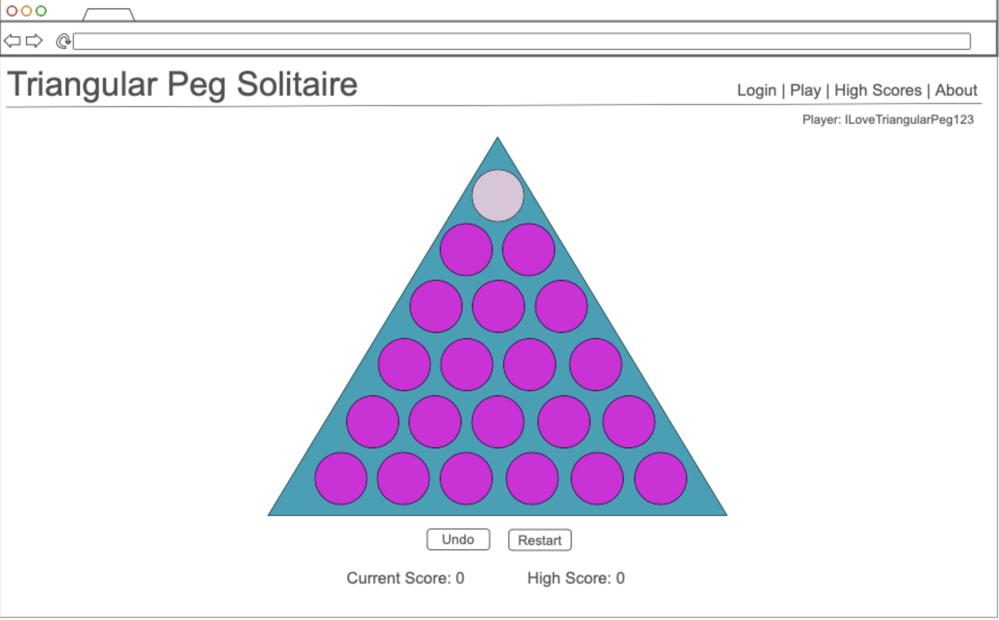
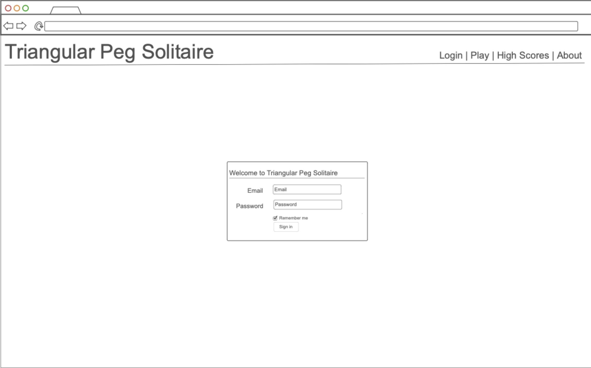

# Triangular Peg Solitaire

## Startup Specification

### Elevator Pitch

Have you ever played triangular peg solitaire? Or rather, have you ever played the game that is always on the tables at Cracker Barrel? Formally known as triangular peg solitaire, this mind stretching game can be extremely entertaining. This application brings the game triangular peg solitaire to your fingertips. Users make moves jumping pegs over each other, resulting in the peg that was jumped being removed, attempting to win the game by leaving only a single peg remaining. 

### Design

Above are mock ups for the login and gameplay pages of triangular peg solitaire. 

### Key Features
- Secure login over HTTPS
- Ability for user to move pieces on the board in order to play the game.
- Ability to reset game/undo move
- Current number of moves by user displayed
- High scores from all users displayed in real time on high scores page.
- About/How to play the game on about page. 

### Technologies
I am going to use the required technologies in the following ways:
- HTML - Uses correct HTML structure for application. Four HTML pages, including login, play, scores, and about.
- CSS - Application styling that looks good on different screen sizes
- JavaScript - Provides login, moving pieces
- React - application with views componentized and reactive to user's actions.
- Web Service - backend service with endpoints for: 
  - Saving scores
  - Displaying random picture on about page using, https://api.api-ninjas.com/v1/randomimage
- Authentication - Input for user to create account and log in. User's name is displayed after log in.
- Database Data - User login. Credentials securely stored in database. High scores of all players. 
- WebSocket Data - Realtime data generated by service. Latest high scores from different useres are displayed. 
## HTML Deliverable
For this deliverable I built the structure of my application using HTML

- HTML Pages - Four HTML pages including a page to login, to play the game, to view high scores, and about the game.
- Links - The login page automatically links to the play page. All pages contain links to the others.
- Text - Textual content is included largely in the about page with a textuald description of the game.
- Web Service Placeholder - image on about page is currently serving as a placeholder where random images will be desplayed.
- Images - image included on about page for visual aesthetics.
- DB/Login - Input box and submit button for login. High scores represent data pulled from database. Current user name is displayed on play page.
- Websocket - Placeholder for websocket on high scores page. Represents display of realtime high scores from different users. Second placeholder on play page representing when users start or end games.

## CSS Deliverable
For this deliverable I properly styled the application into its final appearance
- Header, footer, and main content body
- Navigation Elements - Styled across top of page, no underlines
- Window Resizing Responsiveness - Elements of application are responsive to resizing, grow/shrink in reponse to changes.
- Application Elements - Used consistent color themes, with good contrast.
- Application Text Content - Used consistent fonts
- Application Images - Image on about page is properly styled, responsive to window resizing.

## React Deliverale
For this deliverable I used JavaScript and React so the application now works for a single user. I also added placeholders for future technology.
- Bundled and transpiled - done!
- Components - Play, Scores, and About are all components with with mocks for login WebSocket.
  - login - when you press login it takes you to the play page
  - scores - updates using localstorage with recent high scores
  - play - contains game component, players component, and controls component. When user wins/the game ends it uses those components to alter the layout of the page. Mock for WebSocket with live updates about players. 
  - about - contains placeholder for web service, random images. 
  - database - displaying high scores. Stored and retrieved from local store, will be replaced with database data later.
  - WebSocket - updates with random messages at a set interval. Will be replaced with WebSocket messages later.
  - application logic - game logic, highlighting possible moves when a user seleßcts a peg, calculating when game is over/won. 
- Router - routing between login and play components (about, high scores, play)
- Hooks - primarily using UseState to track changes within the game. Represents specific states of the game (Ex: current state of board, currently selected peg, etc.)